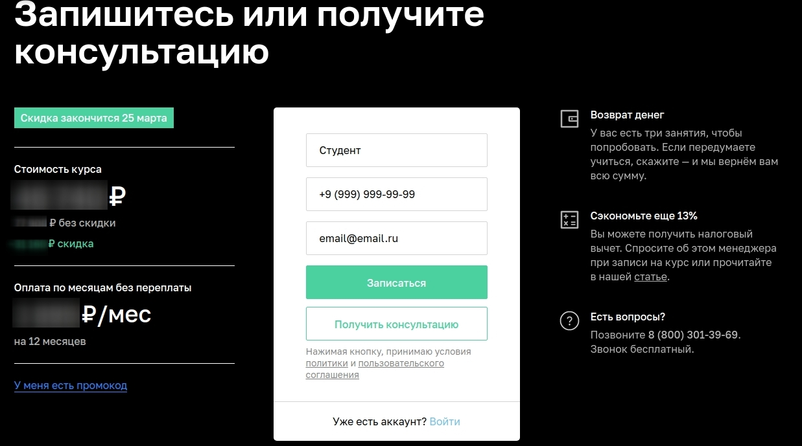

# План автоматизации тестирования возможности записи на обучение профессии "Тестировщик ПО".

## Сайт **_["Нетология"](https://netology.ru/#/)_**
](https://im0-tub-ru.yandex.net/i?id=803f069acc84778182ddbc6cc65b1e07&ref=rim&n=33&w=212&h=150)

## ](https://github.com/netology-code/aqa-homeworks/blob/master/summary/pictures/form.jpg?raw=true)

## Уровни тестирования:

* Модульное тестирование - проверка отдельно модулей "Каталог курсов" и "Заполнение анкеты";
* Интеграционное тестирование - проверка взаимодействия между компонентами (Переход с главной страницы на страницу "
  Каталог курсов", переход из "Каталог курсов" в заполнение анкеты);

## Виды тестирования:

* Функциональное тестирование;

## Перечень автоматизируемых сценариев:

### **_Сценарий первый_**
***
> Путь от главной страницы до анкеты:
>
["Нетология"](https://netology.ru/#/);
***
> 1. Проверка открытия страницы ["Нетология"](https://netology.ru/#/);
> 2. Проверка наличия анкеты в конце страницы на заполнение заявки
> 3. Проверка Заполнения заявки;
> 4. Проверка наличия и работоспособности кнопки "Оставить заявку"
> 5. Проверка отправки заявки;

>**_Ожидаемый результат:_**
>
> 1. Страница ["Нетология"](https://netology.ru/#/) загружена , код ответа **_"200"_** , время ожидания не более 5 секунд;
> 2. В конце страницы анкета на заполнения заявки;
> 3. Поля в анкете заполняются (Значения валидные);
> 4. Название Кнопки **_"Оставить заявку"_** кликабельна (реагирует на клик) после нажатия запрос отправлен код ответа **_"200"_**;
> 5. Заявка отправленна , код ответа **_"200"_**;

### **_Сценарий второй_**
***
> Путь от главной страницы до анкеты:

["Каталог курсов"](https://netology.ru/#/) -> ["Программирование"](https://netology.ru/development) -> ["Тестировщик ПО"](https://netology.ru/programs/qa);
***
> 1. Проверка открытия страницы ["Нетология"]();
> 2. Проверка наличия вкладки ["Каталог курсов"](https://netology.ru/#/);
> 3. Проверка перехода на страницу ["Программирование"](https://netology.ru/development);
> 4. Проверка перехода на страницу ["Тестировщик ПО"](https://netology.ru/programs/qa);
> 5. Проверка кнопки "Записаться" на странице , при успешном переходе есть анкета для заполнения, заполнение анкеты;
> 6. Проверка перехода на страницу ["Запишитесь или получите консультацию"]();
> 7. Проверка перехода на страницу ["Запишитесь или получите консультацию"]() , при успешном переходе есть анкета для заполнения,
     заполнение анкеты;
> 8. Проверка кнопок "Записаться";
> 9. Проверка отправки заявки;

> **_Ожидаемый результат:_**
>
> 1. Страница ["Нетология"](https://netology.ru/#/) загружена , код ответа **_"200"_** , время ожидания не более 5 секунд;
> 2. Вкладка ["Каталог курсов"](https://netology.ru/#/) кликабельная , после нажатия выпадает список с направлениями специальностей (["Программирование"](https://netology.ru/development);
> 3. Нажатие на пункт ["Программирование"](https://netology.ru/development) переводит на страницу ["Тестировщик ПО"](https://netology.ru/programs/qa);
> 4. Кнопка **_"Записаться"_** рабочая (кликабельная)
> 5. Поля в анкете заполняются (Значения валидные);
> 6. Страница ["Запишитесь или получите консультацию"]() загружена , время ожидания не более 5 секунд;
> 7. В конце страницы анкета на заполнения заявки , (Поля в анкете заполняются , Значения валидные);
> 8. Наличие кнопки с названием **_"Записаться"_** , кликабельная (реагирует на клик), при нажатии заявка отправляется;
> 9. Заявка отправленна код ответа **_"200"_**;

### **_Сценарий третий_**

***
> Путь от главной страницы до анкеты:
* ["НЕО для начинающих"](https://netology.ru/#/) -> ["Получите профессию с нуля"](https://netology.ru/neo) -> ["Тестировщик ПО"](https://netology.ru/programs/qa)
***
> 1. Проверка открытия страницы ["Нетология"](https://netology.ru/#/);
> 3. Проверка перехода на страницу ["Получите профессию с нуля"](https://netology.ru/neo)
> 4. Проверка кнопки "Записаться" на странице ( осуществляется переход к пункту заполнения полей в анкете);
> 5. Проверка перехода на страницу ["Запишитесь или получите консультацию"]();
> 6. Проверка перехода на страницу ["Запишитесь или получите консультацию"]() , при успешном переходе есть анкета для заполнения,
     заполнение анкеты;
> 7. Проверка кнопки **_"Получить консультацию"_** на работоспособность (после нажатия запрос уходит).
> 4. Проверка действенности ссылки **_"Нажимая кнопку, принимаю условия политики и пользовательского соглашения"_**;
> 8. Проверка кнопки "Записаться";
> 9. Проверка отправки заявки;

> **_Ожидаемый результат:_**
>
> 1. Страница ["Нетология"](https://netology.ru/#/) загружена , код ответа **_"200"_** , время ожидания не более 5 секунд;
> 2. Нажатие (клик) на вкладку ["НЕО для начинающих"](https://netology.ru/#/) приводит к переходу на страницу ["Получите профессию с нуля"](https://netology.ru/neo) , страница загружена , время ожидания не более 5 секунд;
> 3. После нажатия на курс ["Тестировщик ПО"](https://netology.ru/programs/qa) происходит переход на страницу заполнения анкеты;
> 4. Наличие кнопки с названием **_"Записаться"_**;
> 5. Страница ["Запишитесь или получите консультацию"]() , загружена , код ответа **_"200"_**
> 6. Поля в анкете заполняются (Значения валидные);
> 7. Название Кнопки - **_"Записаться"_** , рабочая (кликабельная) после нажатия , Надпись **_"Заявка принята"_** , выполняется переход на страницу оплаты.
     > Надпись **_""Заявка принята"_** и произойдет перехода на страницу оплаты.
> 8.  Документ о соглашении;
> 9. Выполнен переход на страницу консультации код ответа **_"200"_** , на почту отправляется письмо **_"Заявка на консультацию по
     >  курсу <<Тестировщик ПО>> оформлена"_** .
> 10. Кнопка с названием **_"Записаться" _**кликабельная (реагирует на клик), при нажатии заявка отправляется;
> 11. Заявка отправленна код ответа **_"200"_**;

### Позитивные сценарии тестирования полей формы заявки (**_Анкеты_**):

1. Проверка формы заявки (**_Анкеты_**) валидными значениями:
>  1. **_Имя_** сгенерировать с помощью фейкера на русском;
>  2. **_номер_** мобильного телефона сгенерировать с помощью фейкера;
>  3. **_email_** сгенерировать с помощью фейкера на английском языке;
>  4. Нажатие (клик) на кнопку **_"Записаться"_**;

2. Проверка формы заявки (**_Анкеты_**) валидными значениями:
>  1. **_Имя**_ сгенерировать с помощью фейкера на русском, с дефисом (двойное);
>  2. **_номер_** мобильного телефона сгенерировать с помощью фейкера;
>  3. **_email_** сгенерировать с помощью фейкера на английском языке;
>  4. Нажатие (клик) на кнопку **_"Записаться"_**;

>**_Ожидаемые результаты:_**
>
> 1. Надпись **_"Заявка принята"_** , переход на страницу оплаты.
> 1. Надпись **_""Заявка принята"_** , переход на страницу оплаты.

### Негативные сценарии тестирования полей формы заявки (**_Анкеты_**)

> 1. Заполнение всех полей, кроме **_имени_**;
> 2. Заполнение всех полей, кроме **_номера_**;
> 3. Заполнение всех полей, кроме **_email_**;
> 4. Проверяка на некорректность заполнения формы, ввод в поле **_"имя"_** значение из фейкера, но на английском языке;
> 5. Проверяка на некорректность заполнения формы, ввод в поле **_"имя"_** значение в один символ русской буквы;
> 6. Проверяка на некорректность заполнения формы, ввод в поле **_"имя"_** значение в цифрах;
> 7. Проверяка на некорректность заполнения формы, ввод в поле **_"номер"_**, значение, на единицу меньше правильного числа цифр в номере;
> 8. Проверяка на некорректность заполнения формы, ввод в поле **_"номер"_** значение, на единицу больше правильного числа цифр в номере;
> 9. Проверяка на некорректность заполнения формы, ввод в поле **_"номер"_** любое символьное значение, например, "+";
> 10. Проверяка на некорректность заполнения формы, ввод в поле **_"email"_** значение из фейкера, но на Русском языке;
> 11. Проверяка на некорректность заполнения формы, ввод в поле **_"email"_** значение из фейкера, но без "@";
> 12. Проверяка поля **_"Имя"_** граничными значениями.
> 13. Проверяка поля **_"Email"_** граничными значениями.

> **_Ожидаемые результаты:_**
>
> 1. Надпись **_"поле обязательно для заполнения"_**;
> 2. Появится **_"поле обязательно для заполнения"_**;
> 3. Надпись **_"поле обязательно для заполнения"_**;
> 4. Надпись **_"неправильно введено значение"_**;
> 5. Надпись **_"неправильно введено значение"_**;
>6. Надпись **_"неправильно введено значение"_**;
> 7. Надпись **_"неправильно введено значение или номер должен состоять из 10 цифр"_**;
> 8. Надпись **_"неправильно введено значение или номер должен состоять из 10 цифр"_**;
> 9. Надпись **_"неверный формат"_**;
> 10. Надпись **_"неверный формат"_**;
> 11. Надпись **_"неверный формат"_**;
> 12. Надпись **_"неправильно введено значение"_**;
> 13. Надпись **_"неправильно введено значение"_**;

## Перечень используемых инструментов:

**_java_** | язык програмирования для написания тестов
 -----------|------------------------------------------------------------------------
**_IntelliJ IDEA_**  | программа, для работы с кодом
**_Gradle_**   | система автоматической сборки внутри IntelliJ IDEA
**_JUnit 5_**   | библиотека для тестирования
**_Faker_** | генерация пользовательских данных (имени, телефона, email)
**_Selenide_** | для работы с веб-страницей
**_Rest Assured_** |  библиотека для тестирования REST API, позволяет автоматизировать тестирование get и post запросов.
**_Allure_** | используем для наглядного изображения прохождения тестов и ошибок
**_Git_** | система контроля версий
**_GitHub_** | для хранения тестов
**_GitHub Action_** | CI для непрерывной интеграции

](https://im0-tub-ru.yandex.net/i?id=ac6d83994beddfa921575d0c1a605eca&ref=rim&n=33&w=150&h=150)
](https://im0-tub-ru.yandex.net/i?id=60cc9cb4460463d1f83595d3ede3c43d&ref=rim&n=33&w=150&h=150)
](https://im0-tub-ru.yandex.net/i?id=4e2de00e9c8643235ab4aa45203b7299&ref=rim&n=33&w=217&h=150)
](https://im0-tub-ru.yandex.net/i?id=60e22a1e490a59813afcdfce78c40da8&ref=rim&n=33&w=267&h=150)
](https://im0-tub-ru.yandex.net/i?id=bd05275f229047a082c15a89391d1828&ref=rim&n=33&w=150&h=150)
](https://im0-tub-ru.yandex.net/i?id=b42c7cae2113cfb7a05f426d5a376e0d&ref=rim&n=33&w=286&h=150)
](https://im0-tub-ru.yandex.net/i?id=b688ce10f0a9a4c7036f427a8c127bbb&ref=rim&n=33&w=221&h=150)
](https://www.ph4.ru/DL/LOGO/a/allure.gif)
](https://www.pvsm.ru/images/2019/09/23/GitHub-zapuskaet-svoi-shupalca-v-CI-CD-i-menedjment-artefaktov.png)
## Перечень необходимых разрешений:

* Разрешение на тестирование страниц сайта с помощью автоматизированного ПО;
* Разрешение на доступ к базе данных;
* Предоставление тестовых аккаунтов.

## Перечень и описание возможных рисков при автоматизации:

* Возможна смена кода страницы либо css-селекторов, придется править код;
* Смена формы заполнения после какого-либо времени;
* Невозможность написания в форме некоторых букв (например, буквы ё);
* Долгое открытие страницы сайта, либо вкладки;
* Недоступность сайта или страницы;
* Неоправданная стоимость автоматизации;
* Искажение результатов тестов в связи с отсутствием доступа к реальной БД;

## Перечень необходимых специалистов для автоматизации:

* Специалист по автоматизированному тестированию;

## Интервальная оценка с учётом рисков (в часах):

* Необходимое время на тестирование составляет 50 часов, с учетом рисков - 65 часов. 